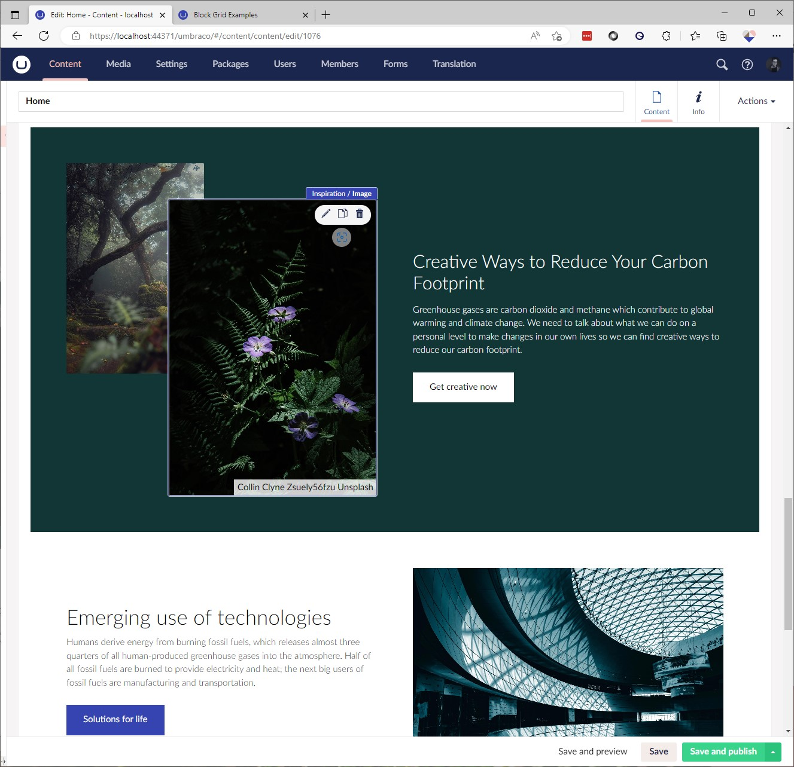

# Umbraco Block Grid Example Website


An example of Umbraco Block Grid as a simple installable starter kit. This package is to help showcase what can be achieved with the new block grid editor in Umbraco.

> **Note** 
> This requires .NET7+ and Umbraco 11.0.0+

## Installing
To install the Umbraco Block Grid Example site you need a minimum of Umbraco 11.0.0 RC5 or newer and then to add the following Nuget package to your project containg the Umbraco website.

```
dotnet add package Umbraco.BlockGrid.Example.Website
```

### Umbraco Block Grid Website


### Umbraco Backoffice Block Grid



## Contributing
This package is open to be collobrated on with the wider Umbraco community.

You can get up and running really quickly by cloning down the website and running dotnet build at the root of the repository and running the website found in `UmbracoBlockGrid.Site`

```
dotnet build UmbracoBlockGrid.sln
cd UmbracoBlockGrid.Site
dotnet run 
```

### Using GitHub Codespaces
You can work and contribute to this project using your FREE hours on GitHub Codespaces. This is a great way to get up and running quickly and contribute to the project.

[](https://github.com/codespaces/new?hide_repo_select=true&ref=main&repo=569757441&machine=standardLinux32gb&devcontainer_path=.devcontainer%2Fdevcontainer.json&location=WestEurope)


The CodeSpace will have the following preinstalled or configured for you

* Installed .NET 7 SDK
* Done a Nuget restore
* Installed SQLite and the supporting VSCode extension to browse, query and edit the database
* SMTP4Dev installed and running to view emails sent out from the website with its web UI on port 5000
* Debugging enabled for the website in the Run & Debug section


### Dependencies

We are using the community package uSync from Kevin Jump in order to synchronize changes to document types and configuration, as the base product is free and open source for all to use.
